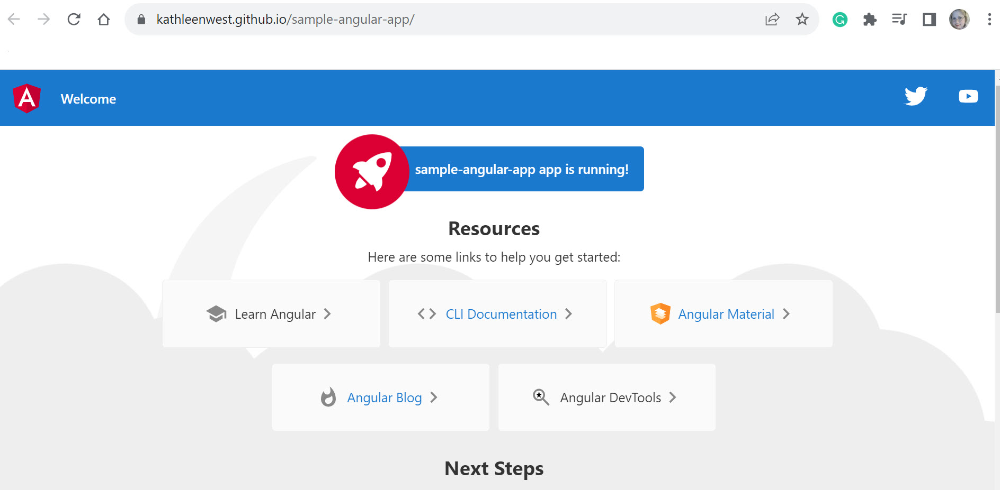
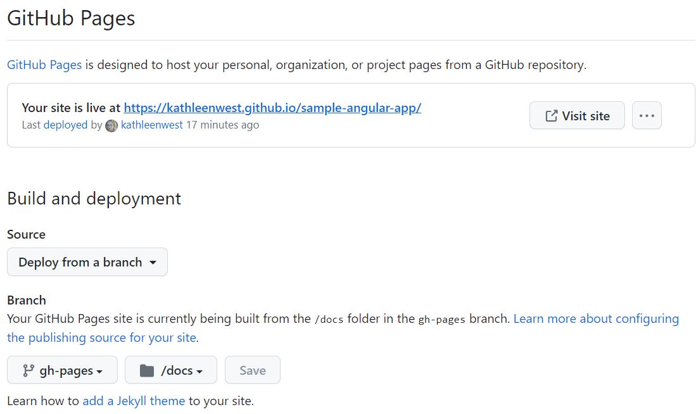

# sample-angular-app
 
Quick step-by-step tutorial on how to create the sample default angular app deploy to GitHub Pages.

The result of following these guided steps will be that your sample angular site is visible on GitHub like the screen capture shown below (Example: https://kathleenwest.github.io/sample-angular-app/):

## Step 1 - Create Angular App

Open a terminal window, create a new angular app, then navigate to the app root directory.

`ng new sample-angular-app`

## Step 2 - Add Base Href To App

Open the file _src/index.html_ and add the _sample-angular-app_ for base href

`<base href="/sample-angular-app">`

## Step 3 - Create Local Git Repo for Folder

Via console or GitHub Desktop

## Step 4 - Publish to GitHub

Publish as public repo (if you have the free plan)

## Step 5 - Create and check out a git branch named gh-pages

`git checkout -b gh-pages`

## Step 6 - Build your Project

Build your project using the GitHub project name, with the Angular CLI command ng build and the following options, where your_project_name is the name of the project that you gave the GitHub repository.

Be sure to include the slashes on either side of your project name as in /your_project_name/.

`ng build --output-path docs --base-href /sample-angular-app/`

## Step 7 - Build 404 File

When the build is complete, make a copy of docs/index.html and name it docs/404.html

## Step 8 - Commit your changes and push

Push the working branch _gh-pages_

## Step 9 - Configure GitHub Pages

On the GitHub project page, go to Settings and select the Pages option from the left sidebar to configure the site to deploy from your branch (gh-pages) and the _/docs_ folder as seen in the screen capture below.

Your deployment may take some time, but you will soon see the url/link as seen in the screen capture above.

Your site is live at https://kathleenwest.github.io/sample-angular-app/
